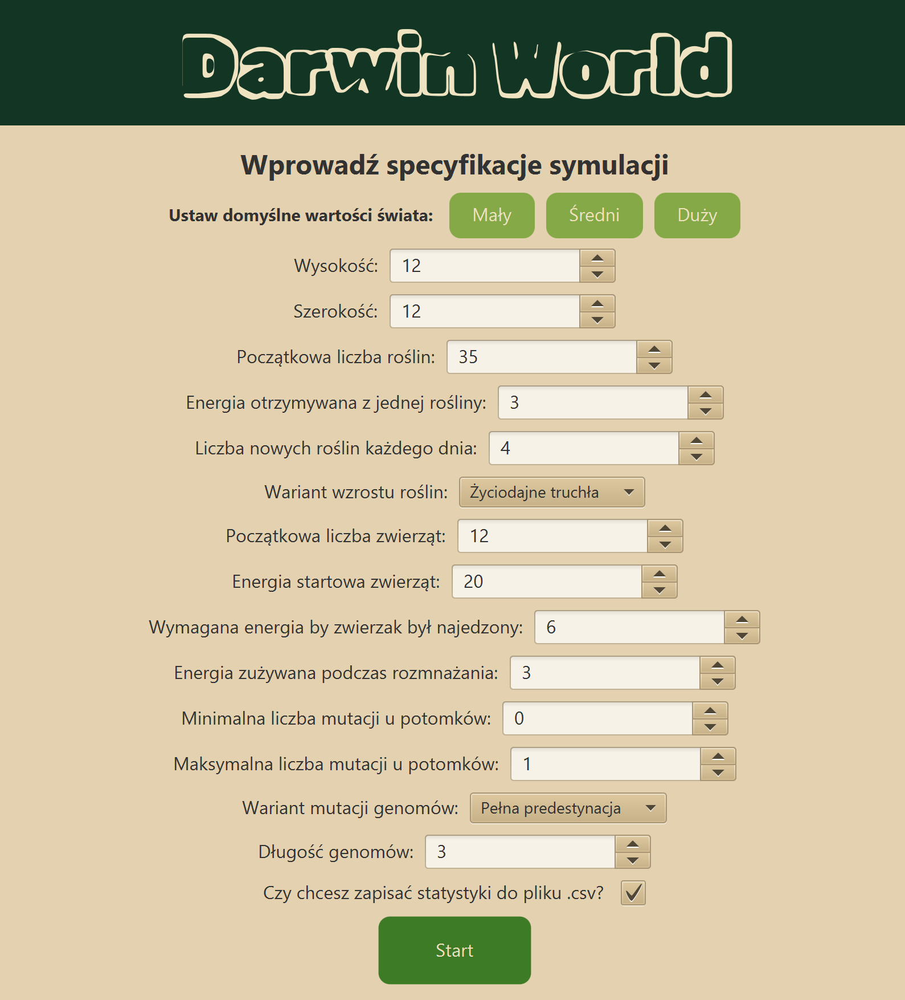
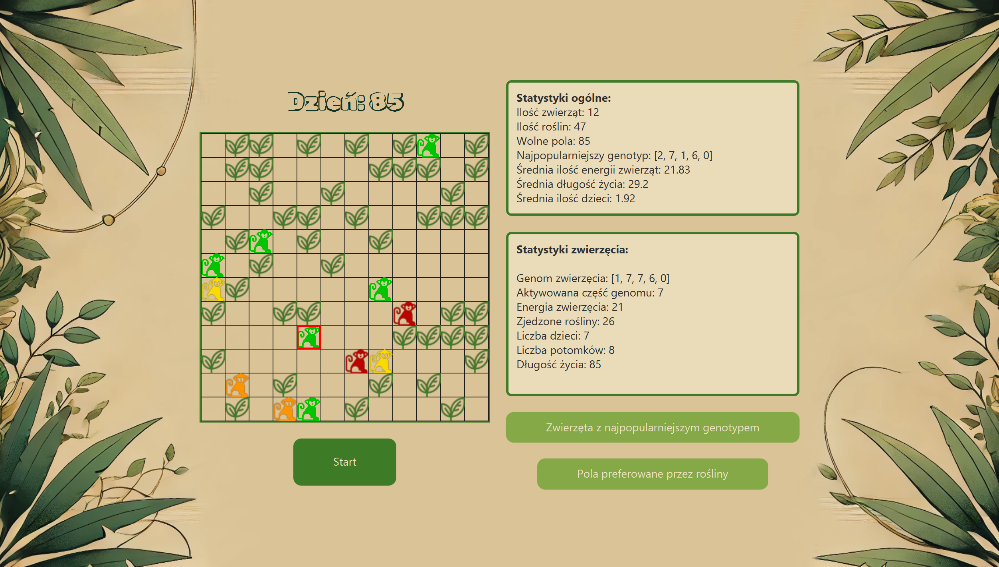
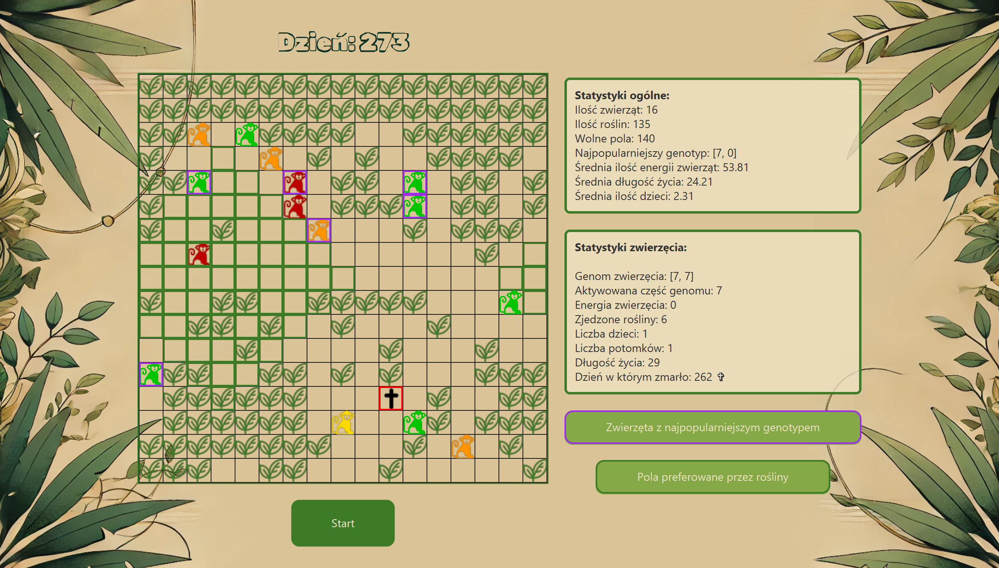

# Projekt Darwin

Projekt stworzony w ramach przedmiotu Programowanie obiektowe

Autorzy:
Szymon Tworek, Piotr Świerzy

# Treść projektu

Dokładny opis wymagań projektu znajduje się [tutaj](https://github.com/Soamid/obiektowe-lab/tree/master/proj) 

Ogólna koncepcja to stworzenie symulacji ewolucji na świecie o parametrach wybranych przez użytkownika

   

Zwierzęta poruszają sie po mapie jedząc rośliny i rozmnażając się. 

Poszczególne zwierzę opisuje parametr genów odpowiadający za poruszanie sie zwierzaka po mapie.
Geny przekazywane sa przez rodziców z ewentualnymi modyfikacjami określonymi w specyfikacji przez użytkownika.

Przyglądając się symulacji mamy również dostęp do szczegółowych informacji statystycznych dotyczących tego jak prezentuje się sytuacja na naszym świecie. Istnieje również możliwość wybrania zwierzaka którego statystyki będziemy śledzić.

   

Dostępne są także opcje zaznaczenia zwierząt o genotypie który aktualnie dominuje na mapie a także wyróżnienia pól na których rośliny preferują rosnąć.

   

